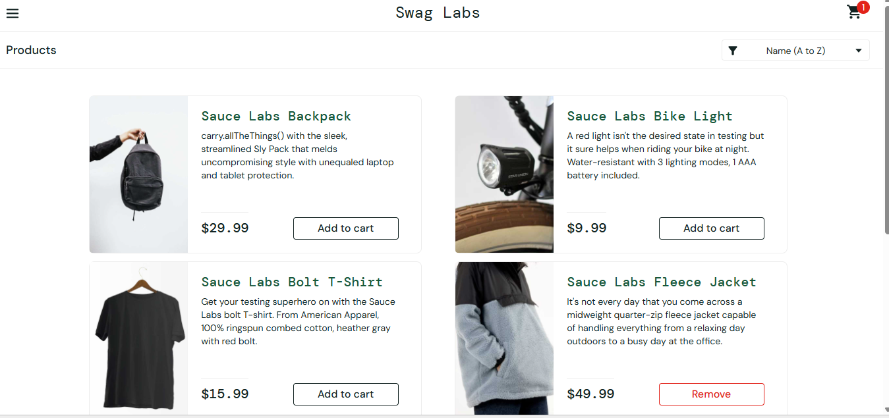
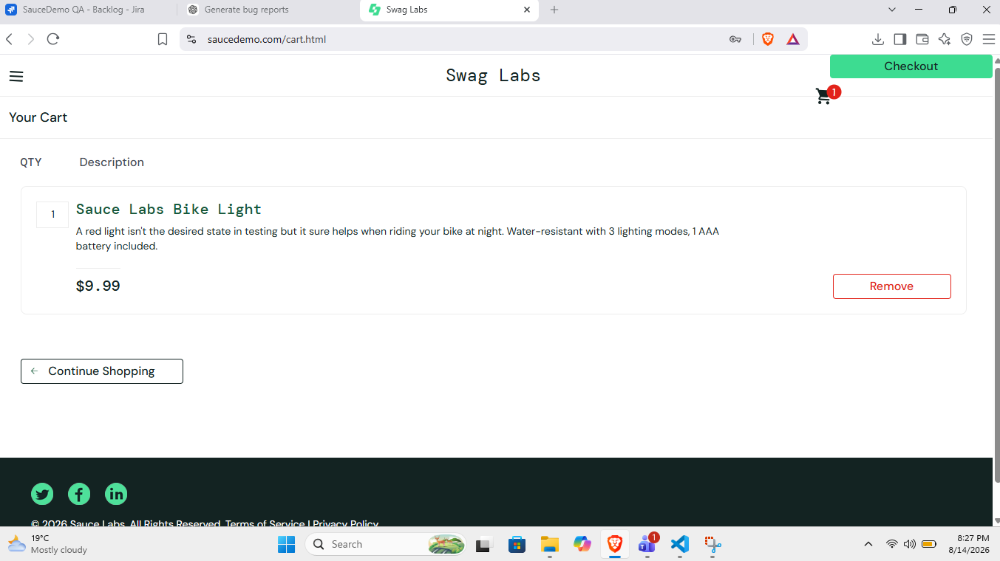

Bug Report Project
# Bug Report Portfolio - E-commerce Web App

This repository contains my manual testing portfolio for a web-based E-commerce application. 
It documents 10 real bugs found during functional, UI, and usability testing.

## Project Overview
**Application Type**: E-commerce Web Application  
**Testing Type**: Manual Testing - Functional, UI, Usability  
**Tool Used**: Browser, Screenshot Tool  
**Total Bugs Reported**: 10  
**Status**: 10 Open

## Bug Summary Table

| Bug ID | Title | Type | Severity |
| --- | --- | --- | --- |
| BUG-01 | User Dog Images Displayed Incorrectly | Functional | High |
| BUG-02 | Cart Count Does Not Reset to Zero | Functional | Critical |
| BUG-03 | Checkout Validation Not Working | Functional | Critical |
| BUG-04 | Last Name Field Not Editable | Functional | High |
| BUG-05 | Checkout Not Completed - Error Shown | Functional | Critical |
| BUG-06 | Incorrect Product Image on Product Detail Page | UI | Medium |
| BUG-07 | Product Card Misalignment | UI/Visual | Low |
| BUG-08 | Price Alignment Issue | UI/Visual | Low |
| BUG-09 | Checkout Button Obscured | UI/Visual | High |
| BUG-10 | Checkout Redirects to Login Page | Functional | Critical |

## Detailed Bug Reports

### BUG-01: User Dog Images Displayed Incorrectly
**Severity**: High  
**Type**: Functional  
**Steps to Reproduce**: 1. Login to application 2. Navigate to User Profile  
**Expected Result**: User's own profile image should be displayed  
**Actual Result**: Dog images are displayed instead of user image  
**Evidence**: 

### BUG-02: Cart Count Does Not Reset to Zero
**Severity**: Critical  
**Type**: Functional  
**Steps to Reproduce**: 1. Add items to cart 2. Complete order 3. Check cart icon  
**Expected Result**: Cart count should reset to 0 after order  
**Actual Result**: Cart count remains at previous number  
**Evidence**: 

### BUG-03: Checkout Validation Not Working
**Severity**: Critical  
**Type**: Functional  
**Steps to Reproduce**: 1. Go to checkout 2. Submit form with empty required fields  
**Expected Result**: Validation errors should appear  
**Actual Result**: Form submits without validation  
**Evidence**: 

### BUG-04: Last Name Field Not Editable
**Severity**: High  
**Type**: Functional  
**Steps to Reproduce**: 1. Go to User Profile 2. Try to edit Last Name field  
**Expected Result**: Field should be editable  
**Actual Result**: Field is disabled / not editable  
**Evidence**: 

### BUG-05: Checkout Not Completed - Error Shown
**Severity**: Critical  
**Type**: Functional  
**Steps to Reproduce**: 1. Add product to cart 2. Proceed to checkout 3. Place order  
**Expected Result**: Order should be placed successfully  
**Actual Result**: Error message shown and order not completed  
**Evidence**: 

### BUG-06: Incorrect Product Image on Product Detail Page
**Severity**: Medium  
**Type**: UI  
**Steps to Reproduce**: 1. Click on any product 2. View product detail page  
**Expected Result**: Correct product image should be displayed  
**Actual Result**: Wrong product image is displayed  
**Evidence**: 

### BUG-07: Product Card Misalignment
**Severity**: Low  
**Type**: UI/Visual  
**Steps to Reproduce**: 1. Go to Product Listing Page  
**Expected Result**: All product cards should be aligned properly  
**Actual Result**: Cards are misaligned  
**Evidence**: 

### BUG-08: Price Alignment Issue
**Severity**: Low  
**Type**: UI/Visual  
**Steps to Reproduce**: 1. Go to Product Listing Page  
**Expected Result**: Price should be aligned consistently  
**Actual Result**: Price text is misaligned  
**Evidence**: 

### BUG-09: Checkout Button Obscured
**Severity**: High  
**Type**: UI/Visual  
**Steps to Reproduce**: 1. Go to Cart page on mobile view  
**Expected Result**: Checkout button should be fully visible and clickable  
**Actual Result**: Button is partially obscured  
**Evidence**: 

### BUG-10: Checkout Redirects to Login Page
**Severity**: Critical  
**Type**: Functional  
**Steps to Reproduce**: 1. Login 2. Add item to cart 3. Click Checkout  
**Expected Result**: Should proceed to checkout page  
**Actual Result**: Redirects back to login page  
**Evidence**: 

## Skills Demonstrated
- Manual Functional Testing
- UI / UX / Visual Testing 
- Bug Reporting with Steps, Severity, and Evidence
- Test Case Documentation
- Attention to Detail and User Experience

## How to Use This Repo
1.  Click on any Bug ID above to see details and screenshot
2.  All evidence is stored in this repository
